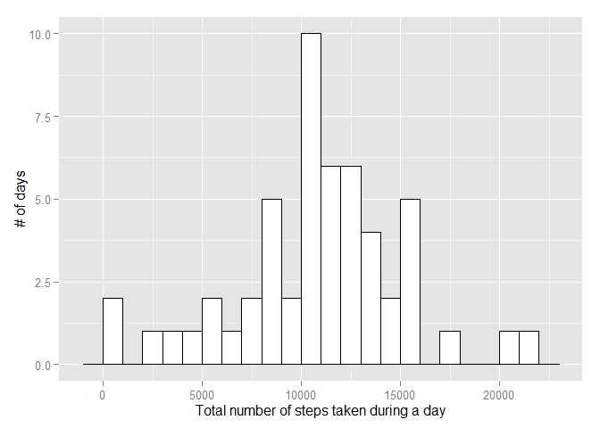
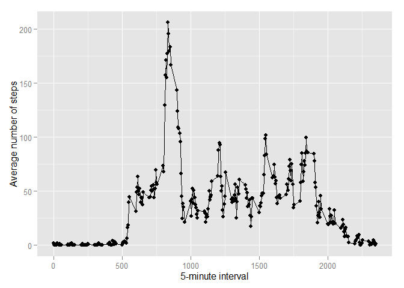
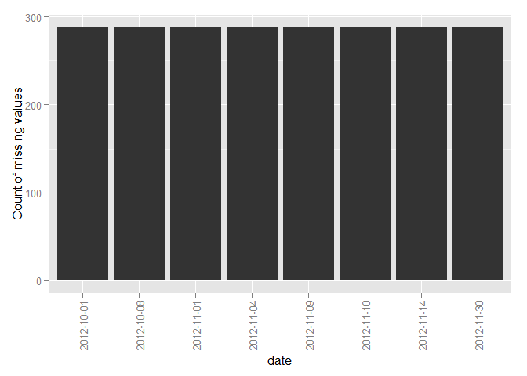
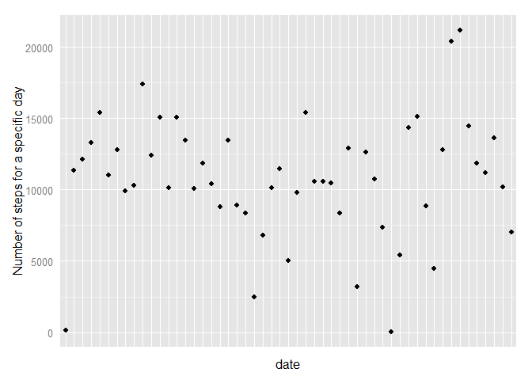
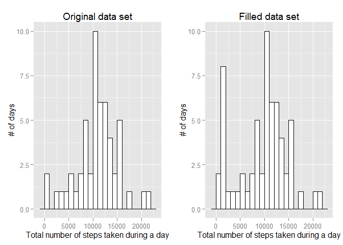
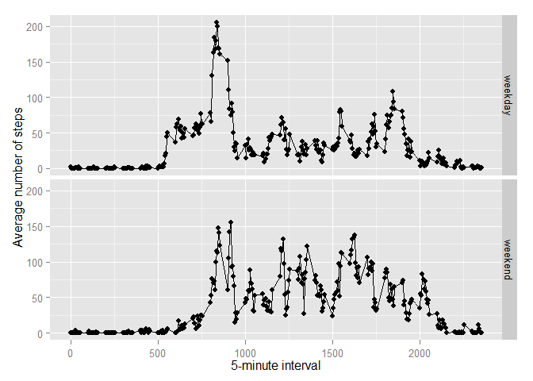

# Reproducible Research: Peer Assessment 1


## Loading and preprocessing the data

Load the data (i.e. `read.csv()`)

```r
# Start by clearing memory
rm(list=ls())

# Prepare and read data
setwd("C:/Users/Tomas/Dropbox/Labbar/RepData/RepData_PeerAssessment1")
unzip("./activity.zip")
activity<-read.csv("activity.csv")
```

Process/transform the data (if necessary) into a format suitable for your analysis


```r
activity$date <- as.factor(as.Date(activity$date))
```

## What is mean total number of steps taken per day?

For this part of the assignment, you can ignore the missing values in the data set.

1. Make a histogram of the total number of steps taken each day

```r
library(ggplot2)
perDayData <- aggregate(steps ~ date, data = activity, sum)

p1a <- ggplot(perDayData, aes(x=steps)) + 
  geom_histogram(aes(y=..count..), binwidth=1000,
                 colour="black", fill="white") + 
  xlab("Total number of steps taken during a day") + 
  ylab("# of days")
print(p1a)
```

 

2. Calculate and report the mean and median total number of steps taken per day

The mean and median total number of steps taken per day is 
10766.2  respectively 
10765  


## What is the average daily activity pattern?

1. Make a time series plot (i.e. type = "l") of the 5-minute interval (x-axis) 
and the average number of steps taken, averaged across all days (y-axis)

```r
perIntervalData <- aggregate(steps ~ interval, data = activity, mean)
p2 <- ggplot(data=perIntervalData, aes(x=interval, y=steps)) + geom_line() + 
  geom_point() +
  xlab("5-minute interval") + 
  ylab("Average number of steps")
print(p2)
```

 


2. Which 5-minute interval, on average across all the days in the data set, contains 
the maximum number of steps?


```r
mxAvg <- perIntervalData[which.max(perIntervalData$steps),]
```

The 5-minute interval, 835, has the maximum number of steps, 
206.2


## Imputing missing values

Note that there are a number of days/intervals where there are missing values 
(coded as NA). The presence of missing days may introduce bias into some 
calculations or summaries of the data.

1. Calculate and report the total number of missing values in the data set (i.e. the 
total number of rows with NAs)


```r
rowsWithNAs <- !complete.cases(activity)
missing <- sum(rowsWithNAs) 
```

There are 2304 missing values out of total 17568. Only 
"steps" has missing values:


```r
sapply(activity,anyNA)
```

```
##    steps     date interval 
##     TRUE    FALSE    FALSE
```

2. Devise a strategy for filling in all of the missing values in the data set. The 
strategy does not need to be sophisticated. For example, you could use the mean/
median for that day, or the mean for that 5-minute interval, etc.

The figure below shows that missing values seems to be days without any 
reporting at all.


```r
ggplot(data=activity[rowsWithNAs,],aes(x=date)) + geom_bar() + 
  theme(axis.text.x  = element_text(angle=90, vjust=0.5)) +
  ylab("Count of missing values")
```

 


The figure below shows that there is no significant trend over time. 


```r
ggplot(data=perDayData,aes(x=date,y=steps)) + geom_point() + 
  theme(axis.ticks = element_blank(), axis.text.x = element_blank()) +
  ylab("Number of steps for a specific day")
```

 

A strategy could be to replace missing values for a day with the median 
over all days for each interval.


3. Create a new data set that is equal to the original data set but with the missing 
data filled in.


```r
# Get values to fill NAs with
templateDay <- aggregate(steps ~ interval, data = activity, median)
# Get a copy of values that is not NAs
activity$filledSteps[!rowsWithNAs] <- activity$steps[!rowsWithNAs]
# Get values from template for all NAs by matching interval
activity$filledSteps[rowsWithNAs] <- templateDay$steps[ 
  match( activity$interval[rowsWithNAs], templateDay$interval ) ]
```

4. Make a histogram of the total number of steps taken each day and Calculate and 
report the mean and median total number of steps taken per day. Do these values 
differ from the estimates from the first part of the assignment? What is the 
impact of imputing missing data on the estimates of the total daily number of steps?


```r
perDayFilledData <- aggregate(filledSteps ~ date, data = activity, sum)

p1b <- ggplot(perDayFilledData, aes(x=filledSteps)) + 
  geom_histogram(aes(y=..count..), binwidth=1000,
                 colour="black", fill="white") +
  ggtitle("Filled data set") + 
  xlab("Total number of steps taken during a day") + 
  ylab("# of days")
p1a <- p1a + ggtitle("Original data set") 
multiplot(p1a,p1b,cols=2)
```

```
## Loading required package: grid
```

 

The mean and median total number of steps taken per day in this new data set is 
9503.87  respectively 
10395 compared to 
10766.2  respectively 
10765  in the original set. 

The impact of imputing missing data on the estimates of the total daily number 
of steps is that estimates gets lower. The mean is more sensitive than the 
median.


## Are there differences in activity patterns between weekdays and weekends?

The upper panel shows the average number of steps during a weekday and the lower 
panel shows corresponding values during a weekend day (Saturday or Sunday). 
Activity starts earlier during weekdays than during a weekend day. On the other hand the activity is lower during the day when the subject probable is working.


```r
tmp<-Sys.getlocale("LC_TIME")
invisible(Sys.setlocale("LC_TIME", "C"))

# Add information on type of day
activity$weekdays <- as.factor(weekdays(
  strptime(activity$date, format="%Y-%m-%d"), abbreviate = TRUE))
activity$typeOfDay <- 
  as.factor(c("weekday","weekend")[activity$weekdays %in% c("Sat","Sun")+1])


perIntervalFilledData <- aggregate(filledSteps ~ interval + typeOfDay, 
                                   data = activity, mean)
ggplot(data=perIntervalFilledData, 
       aes(x=interval, y=filledSteps, group=typeOfDay)) + 
  geom_line() + geom_point() +
  xlab("5-minute interval") + 
  ylab("Average number of steps") +
  facet_grid(typeOfDay ~ . )
```

 

```r
invisible(Sys.setlocale("LC_TIME", tmp))
```

